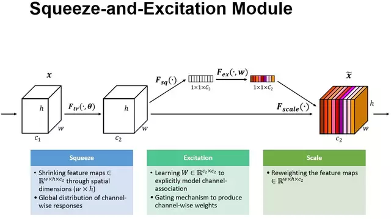

# Music Genre Recognition with CNN

Project for the Numerical Analysis For Machine Learning 2022/23 course at Politecnico di Milano

**Professor**: Edie Miglio

**Students**: Leonardo De Clara, Samuele Delpero

### Project Specification

The project was aimed at implementing DL model for music genre recognition through a Convolutional Neural Network (CNN) making use of Squeeze&Excitation (SE) blocks to improve the representational power by performing dynamic channel-wise feature recalibration, following [Xu and Zhou's design](https://ieeexplore.ieee.org/abstract/document/9306374).  
The dataset used to train and test the model is [GTZAN](https://www.kaggle.com/datasets/andradaolteanu/gtzan-dataset-music-genre-classification).  

    

### Tools
**Tensorflow** - ML framework for developing ML/DL models.
